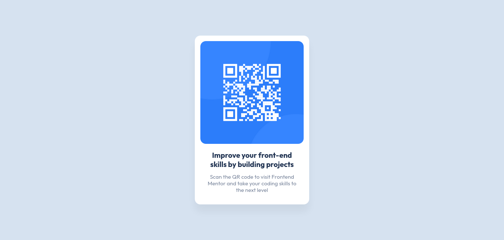

# Frontend Mentor - QR code component solution

This is a solution to the [QR code component challenge on Frontend Mentor](https://www.frontendmentor.io/challenges/qr-code-component-iux_sIO_H). Frontend Mentor challenges help you improve your coding skills by building realistic projects.

## Table of contents

- [Overview](#overview)
  - [Screenshot](#screenshot)
  - [Links](#links)
- [My process](#my-process)
  - [Built with](#built-with)
  - [What I learned](#what-i-learned)
- [Author](#author)

## Overview

### Screenshot

### Links

- Solution URL: [https://github.com/MayyarZidane/QR-Code-Component](https://github.com/MayyarZidane/QR-Code-Component/)
- Live Site URL: [https://mayyarzidane.github.io/QR-Code-Component/](https://mayyarzidane.github.io/QR-Code-Component/)

## My process

### Built with
- Flexbox
- Neovim
- Tmux

### What I learned
- How to add favicon
- How to build exact copy for design
- how to build a project in [Frontend Mentor]("https://www.frontendmentor.io/")

## Author
- Frontend Mentor - [@MayyarZidane](https://www.frontendmentor.io/profile/MayyarZidane)

